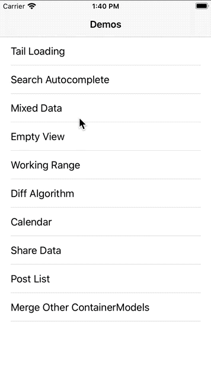
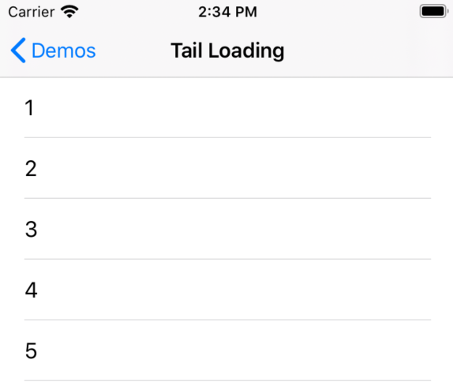
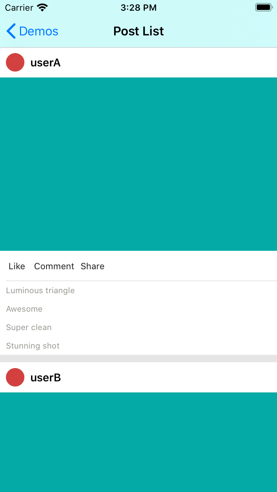
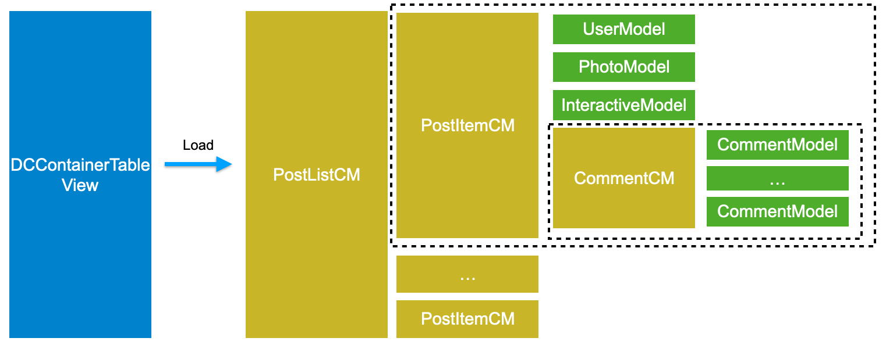

# DCFrame

[](https://travis-ci.org/github/bytedance/DCFrame)
[](https://cocoapods.org/pods/DCFrame)
[](https://cocoapods.org/pods/DCFrame)
[](https://cocoapods.org/pods/DCFrame)

[中文版 README](./README_CN.md)

DCFrame is a Model-driven UI framework with applications in the following areas: assmeblying and arranging complex views with ease; reusing and rearranging view components at no cost; communication between views without couplings.

DCFrame has advantages in the following areas when compared with [IGListKit](https://github.com/Instagram/IGListKit)  by Instagram:

1. **Less-weigted: **only 3.4K lines of code
2. **Allowing composite models: **managing and arranging complex views individually
3. **Low learning cost: **easily accessing protocols with a Model-driven view structure, managing data without using delegates
4. **Zero coupling in communications: **provided a complete event sending and data sharing mechanism to achieve communication between view components with zero coupling.

## Requirements

* Xcode 10.2+
* iOS 9.0+
* Swift 5.0+

## Installation

#### Cocoapods

```ruby
pod 'DCFrame'
```

## Getting Started

### Demo

For those who are already familiar with the IGListKit to quickly get started with DCFrame, we provided the same example set as [IGListKit](https://github.com/Instagram/IGListKit) for reference. Simply pull the repo and run `pod intall` under the 'Example' folder to run the Demo.



### Creating a simple list



With DCFrame, you can easily create a list in three steps: 

1. Create a CellModel
2. Create a DCCell
3. Load a set of CellModel with the ContainerView

#### 1. Create a CellModel

The list above is only displaying a single Label, so we can nave the CellModel here as `LabelModel`. This CellModel inherits from the `DCCellModel` class. The CellModel not only contains the data and data analyzing logics the view requires, it's also required to set the `cellClass` and the height of the Cell `cellHeight`.

- *If the Cell implements Xib, `isXibCell = true` has to be included in `init()`*
- *If the Cell implements auto-layout constraints, cellHeight doesn't have to be initialized, in which DCFrame would adapt the cellHeight automatically*

```swift
class LabelModel: DCCellModel {
    var text: String = ""
    
    required init() {
        super.init()
        cellHeight = 50
        cellClass = LabelCell.self
        isXibCell = true
    }
}
```

#### 2. Creating a Cell

Here we use Xib to create a Cell with a UILabel. We name the Cell as `LabelCell` and make it inherit from `DCCell`. We also have to specify the CellModel generic type required by this cell, which is `LabelModel` in this case. Overriding the `cellModelDidUpdate()` function to update the text of the label when the CellModel updates its text variable. 

- *DCFrame is written based on `UITableView`, therefore the `cellModelDidUpdate` is triggerred by the `tableView(_ tableView: UITableView, cellForRowAt indexPath: IndexPath) -> UITableViewCell` function*
- *To avoid causing errors in the data of the view when reusing `UITableViewCell`, reloading data in `cellModelDidUpate()` is required*

```swift
class LabelCell: DCCell<LabelModel> {
    @IBOutlet weak var label: UILabel!

    override func cellModelDidUpdate() {
        super.cellModelDidUpdate()
      
        label.text = cellModel.text
    }
}
```

#### 3. Loading CellModel

We can tell that each CellModel can represent a list Cell, but displaying the Cell properly needs these two more steps:

1. Create a `DCContainerModel`, and add a set of CellModel into the `DCContainerModel`
2. Create a `DCContainerTableView`, then call the `loadCM(_ cm: DCContainerModel)` method in `DCContainerTableView` to load the CellModel

`DCContainerModel` can be considered as a **"folder"** used to put the CellModels together, while `DCContainerTableView` is a container that loads each of the `DCContainerModel`

If you put this in the context of the original `UITableView`:

- *`**DCFrame` introduces two **View** components: `DCCell` and `DCContainerTableView`***
  - *`DCCell` inherits from `UITableViewCell` and represents the actual elements in the list*
  - *`DCContainerTableView` inherits from `UITableView` and is the container for `DCCell`*

* *`DCFrame` introduces two **Model** components as well: `DCCellModel` and `DCContainerModel`*
  * *`DCCellModel` provides data and data analyzing logic for `DCCell`*
  * *`DCContainerModel` is the container for `DCCellModel*`

```swift
class MyListViewController: UIViewController {
    public let dcTableView = DCContainerTableView()

    override func viewDidLoad() {
        super.viewDidLoad()
      
        view.addSubview(dcTableView)

        loadData()
    }

  	private func loadData() {
      	let listCM = DCContainerModel()
      	for num in 1..<100 {
          	let model = LabelModel()
          	model.text = "\(num)"
          	listCM.addSubmodel(model)
        }
      	dcTableView.loadCM(listCM)
    }
  
  	override func viewDidLayoutSubviews() {
        super.viewDidLayoutSubviews()

    		dcTableView.frame = view.frame
        dcTableView.contentInset = UIEdgeInsets(top: navbarHeight(), left: 0, bottom: safeBottomMargin(), right: 0)
        dcTableView.contentOffset = CGPoint(x: 0, y: -navbarHeight())
    }
}
```

### Creating a Complex List



#### 1. Create Cell and CellModel

Same as creating a simple list, creating a complex list requires different Cell elements. We can tell from the complex list view above that there are four types of Cells in this complex list. For each Cell there's a corresponding CellModel that it gets data from. This can be illustrated by the following image:


#### 2. Combining CellModels

After we created the Cell and CellModel, we can then put them together with the `DCContainerModel`. To construct the complex list above, we can manage the CellModel using the following structure:



1. `CommentCM`: contains multiple `CommentModel`

```swift
/// CommentCM
class CommentCM: DCContainerModel {
    func update(with comments: [String]) {
        removeAllSubmodels()
        for comment in comments {
            let model = CommentModel(comment: comment)
            addSubmodel(model)
        }
    }
}
```

2. `PostItemCM`: assembles `UserModel`, `PhotoModel`, `InteractiveModel`, and `CommentCM`

```swift
/// PostItemCM
class PostItemCM: DCContainerModel {
    func update(with post: PostData) {
        removeAllSubmodels()
        
        let userModel = UserModel(name: post.username)        
        let photoModel = PhotoModel()
        let interactiveModel = InteractiveModel()
        let commentCM = CommentCM()
        commentCM.update(with: post.comments)
        
        addSubmodels([userModel, photoModel, interactiveModel, commentCM])
    }
}
```

3. `PostListCM`：contains multiple `PostItemCM` to achieve displaying information from multiple users

```swift
/// PostListCM
class PostListCM: DCContainerModel {
    private let mockData = [
        PostData(username: "userA", comments: [
            "Luminous triangle",
            "Awesome",
            "Super clean",
            "Stunning shot",
        ]),
        PostData(username: "userB", comments: [
            "The simplicity here is superb",
            "thanks!",
            "That's always so kind of you!",
            "I think you might like this",
        ]),
        PostData(username: "userC", comments: [
            "So good",
        ]),
        PostData(username: "userD", comments: [
            "hope she might like it.",
            "I love it."
        ]),
    ]
    
    override func cmDidLoad() {
        super.cmDidLoad()
        
        for data in mockData {
            let itemCM = PostItemCM()
            itemCM.update(with: data)
            itemCM.bottomSeparator = DCSeparatorModel(color: .clear, height: 10)
            addSubmodel(infoCM)
        }
    }
}
```

We can tell that `DCContainerModel` not only contains `DCCellModel`, it can contain another `DCContainerModel` class as well. Similar to a **"folder"**, we can easily manage complex views with the DCFrame structure.

### Event Handling and Data Sharing


In the complex list above, `InteractiveCell` includes the "Like Comment Share" buttons that trigger the change in background color and label text in the `PhotoCell`. In DCFrame, the update and display of the Cell is achieved through CellModel, so different Cell components can't communicate directly with each other. To achieve the communication between diffrent Cells, there are three steps to follow:

#### 1. Define an Event in InteractiveCell

In DCFrame, Cells are only in charge of triggering the Event, but doesn't care what the Event actually does. For instance, in the example above, clicking the buttons in `InterativeCell` changes the background color of the `PhotoCell` is what the Event actually does, but the "clicking" action is the only thing that the Cell cares and provides.

The transfer of Events is achieved by defining a `DCEventID` in Cell. `DCEventID` is a data type in DCFrame which includes a unique `Int64` integer for each Event defined. 

Typically we would define an Event as `static` type since the `DCEventID` can be considered as the unique name of that Event which belongs to the `InteractiveCell` class itself. When a button is clicked, the Event is sent using the `sendEvent()` method. 

```swift
class InteractiveCell: DCCell<InteractiveCellModel> {
  	// Define an Event
    static let likeTouch = DCEventID()
    static let commentTouch = DCEventID()
    static let shareTouch = DCEventID()
    
    @objc func touch(sender: UIButton) {
        switch sender {
        case likeButton:
            sendEvent(Self.likeTouch, data: sender.titleLabel?.text)
        case commentButton:
            sendEvent(Self.commentTouch, data: sender.titleLabel?.text)
        case shareButton:
            sendEvent(Self.shareTouch, data: sender.titleLabel?.text)
        default: break
        }
    }
}
```

#### 2. Define shared data in PhotoCell

For a `PhotoCell`, the update in the UI is triggered by the change of data in `PhotoModel`. Therefore, updating the UI can be achieved by subscribing to the change of data in `PhotoModel`.

Here, `DCSharedDataID()` is a unique  `Int64` integer data, same as `DCEventID()`, used to represent the unique name of the shared data. However, there are several things to be emphasized:

- *You can subscribe to data not only in `DCCellModel`, but also in `DCCell`. In this case, since the `PhotoCell` may be reused, it's more reasonable to subsricbe the data in `DCCellModel`.*
- *In this example, since the `PhotoModel` is directly owned by `PostItemCM`, we can also assign values to variables in `PhotoCell` after the `PostItemCM` receives the "clicking" Event then reloading the UI with `needReloadCellData()`*

```swift
class PhotoModel: DCCellModel {
    static let data = DCSharedDataID()
    
    var text = ""
    var color: UIColor = UIColor(red: 4/255.0, green: 170/255.0, blue: 166/255.0, alpha: 1.0)

    required init() {
        super.init()
        
        cellClass = PhotoCell.self
        cellHeight = 375
    }
    
    override func cellModelDidLoad() {
        super.cellModelDidLoad()
      
        // Subscribe to shared data
        subscribeData(Self.data) { [weak self] (text: String, color: UIColor) in
            self?.text = text
            self?.color = color
            self?.needReloadCellData()
        }
    }
}
```

#### 3. Interactions Between Components In CM

In addition to arranging CellModels and CMs like a **"folder"**, a CM can also play the role of the mediator in the interaction between components. The interaction logic between different components are often placed in their common parent CM. 

In this example, the closest common parent CM of `InteractiveModel` and `PhotoModel` is `PostItemCM`, so the interaction logic between these two components can be handled in `PostItemCM` as follows:

```swift
class PostItemCM: DCContainerModel {
    override func cmDidLoad() {
        super.cmDidLoad()
        
      	// Respond to Events and share data
        subscribeEvent(InteractiveCell.likeTouch) { [weak self] (text: String) in
            self?.shareData((text, UIColor.red), to: PhotoModel.data)
        }.and(InteractiveCell.commentTouch) { [weak self] (text: String) in
            self?.shareData((text, UIColor.yellow), to: PhotoCellModel.data)
        }.and(InteractiveCell.shareTouch) { [weak self] (text: String) in
            self?.shareData((text, UIColor.blue), to: PhotoCellModel.data)
        }
    }
}
```

### Rules in Sending Events and Sharing Data

There are two rules in the event sending and data sharing process in DCFrame:

1. Events are passed upwards: in the CM tree, any node can produce and send an Event. The Event would then be passed upwards from the current CM node until it reaches the root CM. Any of the CM node on that path can respond to that Event and still pass it upwards.
2. Data is shared downwards: Any CM node can share data. The data would be passed downwards through a preorder traversal to its child nodes. Any child node would then be able to subscribe to the data shared by this CM (In the example above, data is direcly sent to PhotoModel.data. However, other Models can also subsribe to the data, but usually don't do this).


In `DCFrame`, the views are driven by arranging CellModels, so different views are independent from each other. To achieve the communication between Model_A and Model_B, the interaction has to be handled through their common CM node:

- *When Model_A sends an Event, the Event would be passed upwards through the CM tree until it reaches the root node*
- *The root CM then responds to the Event by following the interaction logic to share the related data to Model_B in order to trigger the change in the view of Model_B*

## License

DCFrame is available under the MIT license. See the LICENSE file for more info.
