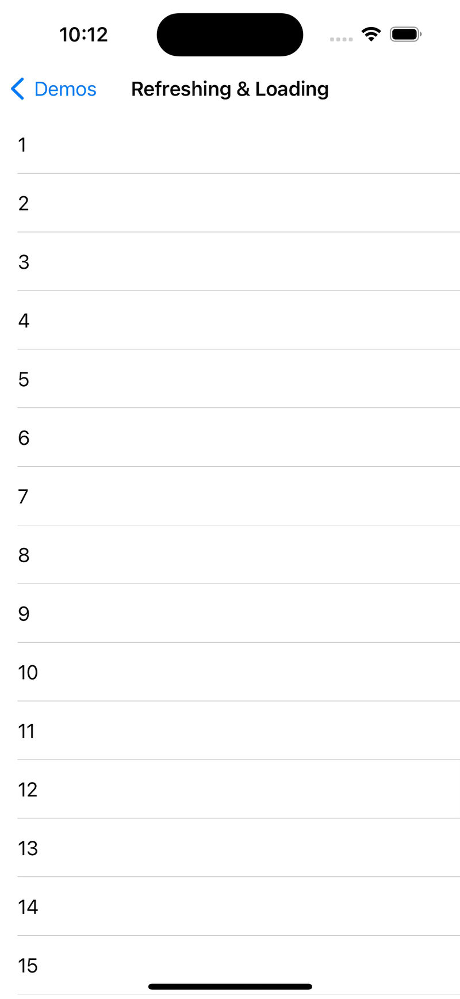
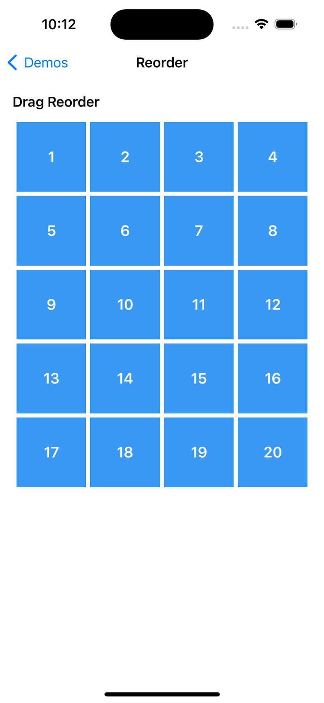
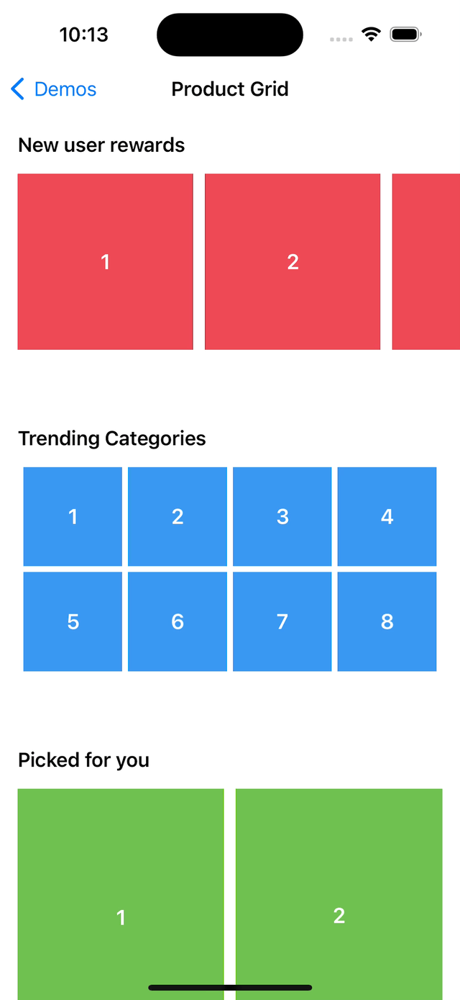
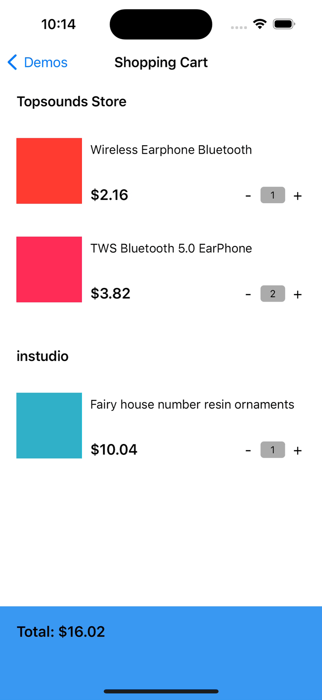
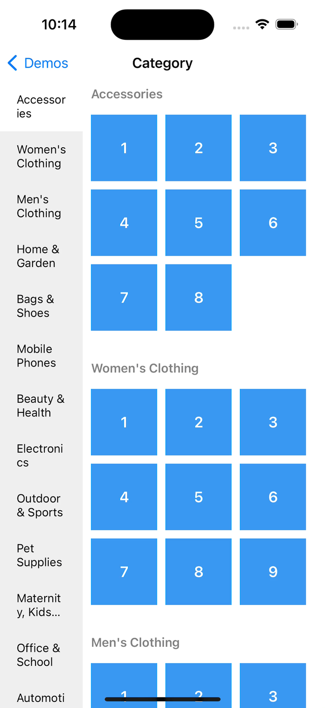

<p align="center">
  
</p>


<p align="center">
    <a href="https://travis-ci.org/github/bytedance/DCFrame">
        
    </a>
    <a href="https://cocoapods.org/pods/DCFrame">
      
    </a>
    <a href="https://cocoapods.org/pods/DCFrame">
        
    </a>
    <a href="https://cocoapods.org/pods/DCFrame">
        
    </a>
</p>

------

DCFrame is a powerful UI collecion framework, it can be easily achieved:

1. Assemble and manage complex UI modules; 
2. Reuse and migrate UI modules at no cost;
3. Communication between UI modules without coupling.

## Requirements

* Xcode 10.2+
* iOS 11.0+
* Swift 5.0+

## Installation

### Cocoapods

[CocoaPods](https://cocoapods.org) is a dependency manager for Cocoa projects. For usage and installation instructions, visit their website. To integrate DCFrame into your Xcode project using CocoaPods, specify it in your `Podfile`:

```ruby
pod 'DCFrame'
```

### Carthage

[Carthage](https://github.com/Carthage/Carthage) is a decentralized dependency manager that builds your dependencies and provides you with binary frameworks. To integrate DCFrame into your Xcode project using Carthage, specify it in your `Cartfile`:

```ruby
github "bytedance/DCFrame"
```

### Swift Package Manager

[Swift Package Manager](https://github.com/apple/swift-package-manager) is a tool for managing the distribution of Swift code. It’s integrated with the Swift build system to automate the process of downloading, compiling, and linking dependencies. To integrate DCFrame into your Xcode project using Swift Package Manager, add it to the dependencies value of your Package.swift:

```swift
dependencies: [
    .package(url: "https://github.com/bytedance/DCFrame.git", .upToNextMajor(from: "1.1.0"))
]
```

## Examples

We can quickly get started with DCFrame through the Examples. We provide some examples in the project, simply pull the git repo and open 'DCFrameExample.xcodeproj' in the 'DCFrameExample' folder. 

<p align="center">
  
  
  
</p>
<p align="center">
  
  
  
</p>

## License

DCFrame is available under the MIT license. See the LICENSE file for more info.
